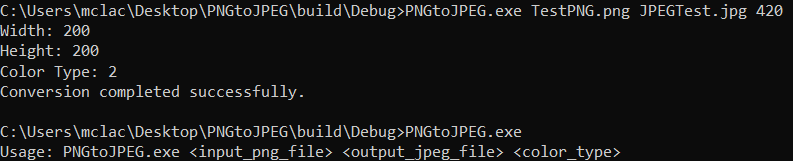
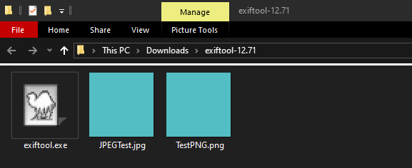
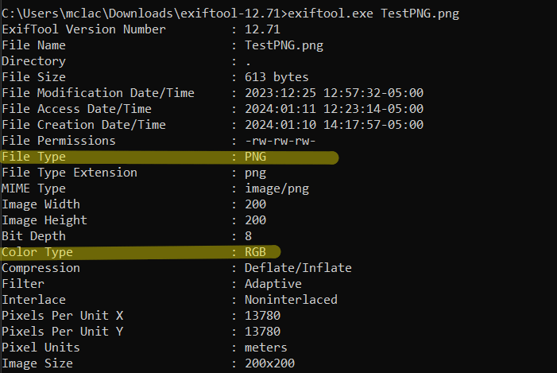
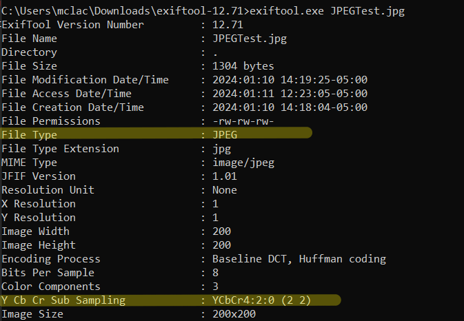

# PNG Image Format to JPEG Converter (C++)

## Overview
The PNG Image Format to JPEG Converter is a C++ application designed for converting images between PNG and JPEG formats. It focuses on efficient image processing, modularity, and supports various YCbCr subsampling schemes (4:4:4, 4:2:2, and 4:2:0).

# System Requirements

## Software Requirements

### Operating Systems
- Windows 10 or newer

### Development Tools
- [CMake](https://cmake.org/download/) (version 3.10 or newer)
  - Used for generating build files and managing dependencies.
- Compiler supporting C++11 standard
  - Windows: Microsoft Visual Studio with C++ development environment.

### Required Libraries
- **[libpng](http://www.libpng.org/pub/png/libpng.html)**
  - For handling PNG file operations.
  - Ensure that `libpng` is installed and properly set up in the system.
- **[libjpeg](http://libjpeg.sourceforge.net/)**
  - For handling JPEG file operations.
  - Ensure that `libjpeg` is installed and properly set up in the system.

## Implementation Details

### Modules

#### PNGReader
- **Functionality**: Handles reading of PNG files.
- **Functions**:
  - `readPNG`: Reads PNG files, decodes the data, and extracts pixel data in RGB format.
- **Libraries**: Utilizes libpng.

#### JPEGWriter
- **Functionality**: Responsible for writing JPEG files.
- **Functions**:
  - `writeJPEG`: Encodes YCbCr data into JPEG format, allowing specification of subsampling schemes.
- **Libraries**: Utilizes libjpeg.

#### ColourConverter
- **Functionality**: Converts RGB data to YCbCr colour space.
- **Functions**:
  - `RGBtoYCbCr`: Converts RGB pixel data to YCbCr.
- **Standards**: Follows ITU-R BT.601 standard for colour space transformation.

### Main Application
- **File**: `main.cpp`
- **Functionality**: Parses command-line arguments to accept input PNG file, output JPEG file name, and colour type. Utilizes the above modules to perform the conversion process.

### Build System
- **CMake**: Used for cross-platform build process management.
- **vcpkg**: Employed as a package manager for handling dependencies like libpng and libjpeg.

### Command-Line Interface
- **Usage**: `./PNGtoJPEG.exe <input_png_file> <output_jpeg_file> <color_type>`
- **Example**: `./PNGtoJPEG.exe input.png output.jpg 420`

## Objectives
- Develop a tool for converting PNG images to JPEG format.
- Implement support for different YCbCr subsampling options (4:4:4, 4:2:2, 4:2:0).
- Ensure high code quality and performance.

## Development Environment
- **Programming Language**: C++
- **External Libraries**: libpng (for handling PNG files), libjpeg (for creating JPEG files).
- **Tools**: Visual Studio Code, CMake (for build configuration), vcpkg (package manager).
- **Platform**: Initially developed for Windows.

## Key Features
- **Reading PNG Images**: Utilizes libpng to decode PNG files, handling various colour types and converting data to standard RGB format.
- **Converting RGB to YCbCr**: Convert RGB444 Values to YCbCr444 values according to ITU-R BT.601-7(03/2011) Section 2.5.1 Construction of luminance (E'y) and colour-difference (E'r-E'y) and (E'b-E'y) signals for accurate colour space transformation.
- **Writing JPEG Images**: Encodes YCbCr data into JPEG format, allowing specification of subsampling schemes and quality settings through libjpeg.
- **Command-Line Interface**: Enables users to specify input/output files and colour subsampling types via command line arguments.

## Testing and Validation
- Verified PNG to standard JPEG with the use of a hex editor, and exiftool open source metadata viewer which confirmed the conversion was correct.

## Challenges and Solutions
- **Colour Space Conversion**: Addressed challenges in accurate RGB to YCbCr conversions.
- **Subsampling Configuration**: Managed different YCbCr subsampling options in JPEG encoding.
- **Library Integration**: Utilized vcpkg for streamlined handling of external library dependencies.

## Results and Verification
- Successfully converts PNG images to JPEG format with customizable subsampling settings.
- Verified output JPEG quality and format correctness using tools like hex editors and exiftool.
- Maintained high image quality in the output files.

## Future Enhancements
- Cross-platform compatibility to extend support for Linux and macOS.
- Implementation of batch processing for handling multiple images.
- Enhanced error handling and logging for better user feedback and debugging.
- Support for other PNG colour formats (ex indexed colour, grayscale) and bitsize conversion.
- JPEG to PNG conversion support.

## Conclusion
This project demonstrates effective image data handling, colour space conversions, and external library integration in C++. It provides a versatile and customizable tool for image format conversion, showcasing proficiency in image processing and software development practices.

